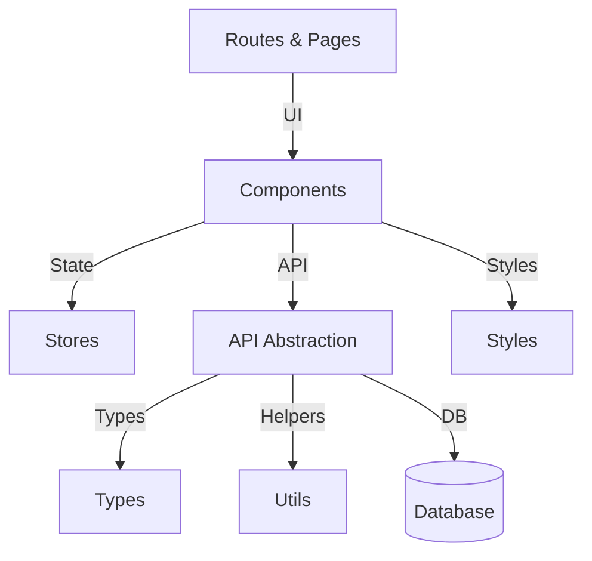

# 🚀 OpenSourceHub

A modern, full-stack SvelteKit 5 app for exploring and analyzing open-source GitHub developers. Features AI-powered profile breakdowns, dynamic dashboards, and fast edge-deployed serverless functions—all in a single monorepo, ready for Vercel.

<p align="center">
  
  
  
  
  
</p>

---

## 📚 Table of Contents
- [Tech Stack](#-tech-stack)
- [Features](#-features)
- [Getting Started](#-getting-started)
- [Architecture](#-architecture)
- [Deploying to Vercel](#-deploying-to-vercel)
- [Customization & Improvements](#-customization--improvements)
- [License](#-license)

---

## 🧱 Tech Stack
- **Frontend:** SvelteKit 5, TypeScript, TailwindCSS
- **Backend API:** SvelteKit API Routes (+server.ts)
- **Database:** Neon (PostgreSQL) via Drizzle ORM
- **Charts:** Chart.js
- **Hosting:** Vercel (frontend + backend together)

---

## ⚙️ Features
- 🔍 **GitHub Profile Analyzer:** Input a GitHub username to fetch language stats, repo activity, and top contributions using GitHub’s GraphQL API.
- 📊 **Live Dev Dashboard:** Interactive graphs showing commit frequency, language breakdowns, and repo metrics.
- 🛡️ **Backend Logic:**
  - API rate limiting
  - Data caching (Postgres)
  - Server-side validation
- 🧩 **Full-Stack in One Codebase:** Unified SvelteKit project—no separate frontend/backend repos.

---

## 🚀 Getting Started

### 1. Clone the Repo
```sh
git clone <your-repo-url>
cd <repo-folder>
```

### 2. Install Dependencies
```sh
npm install
```

### 3. Set Up Environment Variables
Create a `.env` file in the project root:
```env
DATABASE_URL=postgresql://<user>:<password>@<host>:<port>/<database>
GITHUB_TOKEN=ghp_xxx...   # (GitHub personal access token)
```
- Get your Neon/Postgres connection string from the Neon dashboard.
- Create a GitHub personal access token at https://github.com/settings/tokens (no scopes needed for public data).

### 4. Run Database Migrations
```sh
npx drizzle-kit push
```

### 5. Start the Dev Server
```sh
npm run dev
```
Visit [http://localhost:5173/dashboard](http://localhost:5173/dashboard) to use the dashboard.

---

## 🏗️ Architecture



**Folder Structure:**

```
src/
  lib/
    components/   # Reusable UI components
    api/          # API abstraction layer
    stores/       # Svelte stores (state management)
    utils/        # Utility functions/helpers
    types/        # TypeScript types/interfaces
    styles/       # Shared/global styles
  routes/         # SvelteKit routes (pages, endpoints)
```

- **Separation of concerns:** UI, state, API, and types are modular.
- **Reusable logic:** All business logic and helpers are in `lib/`.
- **Type safety:** All API and component data is typed.

---

## 🌐 Deploying to Vercel
1. Push your code to GitHub.
2. Import your repo at [vercel.com](https://vercel.com/).
3. Set `DATABASE_URL` and `GITHUB_TOKEN` in the Vercel dashboard (Project Settings → Environment Variables).
4. Deploy!

---

## 🛠️ Customization & Improvements
- Add more analytics (commit frequency, PRs, etc.)
- Add cache cleanup (remove expired rows from `github_cache`)
- Polish the UI or add more pages

---

## 📄 License
MIT
